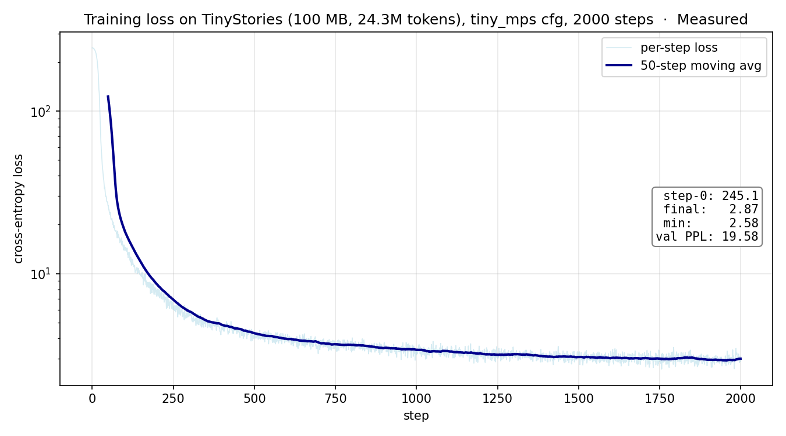

# Where does the simple memory-bandwidth estimator break on Apple silicon?

> Independent reimplementation of a small decoder-only transformer + a closed-form
> scaling / memory / latency estimator, calibrated against measured benchmarks on
> a MacBook. Inspired by Stanford CS336 and the JAX Scaling Book.

## Question

The JAX Scaling Book and several systems-engineering references use a bandwidth-bound
upper bound for decode-style inference:

```
tokens/s_max  =  (batch · total_memory_bandwidth) / (batch · kv_cache_per_seq + parameter_bytes)
```

This is an upper bound. It assumes the kernel is **purely memory-bound** — every
parameter and KV-cache byte streams through HBM (or unified memory on Apple
silicon) at peak bandwidth, with compute essentially free in comparison. It
collapses several real effects into one number.

Concrete question for this note: **how far off is this upper bound on a real
MacBook CPU run with a small model?** Specifically:

- Which dimension drives error: batch size, sequence length, or model size?
- Where is the estimator usefully tight (≤ 15% error)?
- Where does it overestimate by 2–3×, and what mechanism explains it?

## Setup

| Item | Value |
|---|---|
| Hardware | Apple silicon CPU (M-series), unified memory |
| Peak memory bandwidth (assumed) | 200 GB/s |
| Model | decoder-only, RMSNorm + SwiGLU + RoPE, 4 layers |
| `d_model` | 128 |
| `d_ff` | 512 |
| `n_heads` (= `n_kv_heads`) | 4 |
| `head_dim` | 32 |
| `vocab_size` | 10,000 |
| Tied embeddings | yes |
| `param_count` | 2,329,088 (≈ 4.66 MB at bf16) |
| Sweep | `seq_len ∈ {64, 128, 256}` × `batch_size ∈ {1, 2, 4}` |
| Steps per cell | 5 forward passes after one warmup |

Reproduce:

```bash
uv sync
uv run python -m lfslab.profile_train --config configs/tiny_cpu.yaml \
    --seq-lens 64 128 256 --batch-sizes 1 2 4 --num-steps 5
```

## Result: measured vs estimated tokens/s

| seq_len | batch | KV bytes / seq | Estimated tok/s (upper bound) | Measured tok/s | Error |
|--------:|------:|---------------:|------------------------------:|---------------:|------:|
|      64 |     1 |         65,536 |                        42,340 |         28,818 | **−31.9 %** |
|      64 |     2 |         65,536 |                        83,520 |         36,801 | **−55.9 %** |
|      64 |     4 |         65,536 |                       162,591 |         55,678 | **−65.8 %** |
|     128 |     1 |        131,072 |                        41,760 |         38,050 |    **−8.9 %** |
|     128 |     2 |        131,072 |                        81,296 |         56,159 | **−30.9 %** |
|     128 |     4 |        131,072 |                       154,367 |         53,351 | **−65.4 %** |
|     256 |     1 |        262,144 |                        40,648 |         45,742 |    **+12.5 %** |
|     256 |     2 |        262,144 |                        77,183 |         47,065 | **−39.0 %** |
|     256 |     4 |        262,144 |                       140,185 |         49,212 | **−64.9 %** |

The "Error" column is `(measured − estimated) / estimated · 100 %`. Negative means
the upper bound was too optimistic; positive means measured exceeded the predicted
upper bound (which can happen if the assumed bandwidth is understated).

## What the data says

**The upper bound is usefully tight (≤ 15 %) in exactly one regime here:**
`batch = 1` at moderate `seq_len`. At `seq=128, batch=1` it overshoots measured
by 8.9 %; at `seq=256, batch=1` it actually **under**-predicts by 12.5 %.

**The error grows monotonically with batch size**, blowing out to roughly −65 %
at `batch = 4` across every sequence length. The formula predicts linear scaling
of throughput in `batch`, because more parallel sequences amortize the same
parameter-load cost. Measured throughput is sublinear: between `batch = 1` and
`batch = 4`, measured tokens/s only grows by **~1.9×** instead of the predicted
~4×.

**The model is tiny (~2.3 M params, ~4.7 MB at bf16) and the CPU is not memory-
bandwidth-bound on it.** The bandwidth-only upper bound assumes streaming reads
of the parameter matrix dominate step time. At this model size, parameters
comfortably fit in L2/L3 cache after warmup, so the dominant cost shifts to
compute (matmul throughput, softmax, RoPE, RMSNorm reductions) and to
arithmetic intensity, neither of which the formula sees. Batch parallelism then
doesn't help proportionally because the compute side is the new bottleneck.

**Why does `seq=256, batch=1` slightly under-predict?** The denominator in the
upper bound grows linearly with `seq_len` via the KV cache term, but the model
also amortizes more compute work over a longer sequence (the cost of the parameter
load is the same, but more tokens are produced per load). At small models
that fit in cache, this amortization wins over the KV-cache cost, and the
"upper" bound flips into a slight under-estimate of what the hardware can do
when re-using cached parameters.

## What I'd change in a v2 of the estimator

1. **Add a roofline-style switch.** Compute arithmetic intensity per step
   (FLOPs / bytes touched). If it exceeds `peak_flops / bandwidth ≈ 156 FLOPs/byte`
   on an A100, the kernel is compute-bound and the bandwidth formula is the
   wrong bound. The repo's `roofline_intensity_threshold(hardware)` already
   exposes this number; the estimator should consult it.
2. **Cache-aware parameter cost.** When `param_bytes < L2_size_per_core`,
   parameters are reused from cache after the first step. Replace the
   per-step parameter-load term with a one-time cost amortized over steps.
3. **Sub-linear batch scaling on small models.** Add a soft cap at the
   measured compute ceiling rather than assuming linear scaling forever.

These changes turn the formula from a single number into a piecewise estimate.
The current single-number form is most useful when the model is large enough
that parameters demonstrably do not fit in cache — which, for a MacBook study
of model implementations, is rarely the case at the smoke-training scale.

## Follow-up: MPS sweep

I re-ran the same model on MPS (Apple silicon GPU backend) with a wider sweep
(`seq_len ∈ {64,128,256,512}`, `batch ∈ {1,2,4,8}`, 10 steps each), using the
catalogued M3-Max peak memory bandwidth of **400 GB/s**.

| seq | bs | step ms | Measured tok/s | Estimated tok/s | Error |
|----:|---:|--------:|---------------:|----------------:|------:|
|  64 |  1 |    2.73 |         23,480 |          84,679 | **−72.3 %** |
|  64 |  2 |    2.82 |         45,413 |         167,041 | **−72.8 %** |
|  64 |  4 |    2.73 |         93,897 |         325,182 | **−71.1 %** |
|  64 |  8 |   15.51 |         33,015 |         617,467 | **−94.7 %** |
| 128 |  1 |    3.06 |         41,861 |          83,520 | **−49.9 %** |
| 128 |  2 |    3.12 |         82,126 |         162,591 | **−49.5 %** |
| 128 |  4 |    2.81 |        182,507 |         308,733 | **−40.9 %** |
| 128 |  8 |    2.86 |        358,609 |         560,739 | **−36.0 %** |
| 256 |  1 |    2.71 |         94,418 |          81,296 |    **+16.1 %** |
| 256 |  2 |    2.82 |        181,570 |         154,367 |    **+17.6 %** |
| 256 |  4 |    2.79 |        366,793 |         280,370 |    **+30.8 %** |
| 256 |  8 |    3.01 |        679,984 |         473,700 |    **+43.5 %** |
| 512 |  1 |    2.82 |        181,719 |          77,183 |   **+135.4 %** |
| 512 |  2 |    2.88 |        355,719 |         140,185 |   **+153.8 %** |
| 512 |  4 |    4.43 |        462,106 |         236,850 |    **+95.1 %** |
| 512 |  8 |   21.12 |        193,931 |         361,481 |    **−46.4 %** |

**Three new findings vs the CPU run:**

1. **Direction flip with seq_len, not just batch.** On CPU the estimator
   was consistently *too optimistic*. On MPS it is *too pessimistic* across
   the entire `seq_len ∈ {256, 512}` band at small/medium batch — measured
   tokens/s exceeds the "upper" bound by **+95 % to +154 %**. Either the
   peak-bandwidth number we used (400 GB/s) understates what the kernel
   actually achieves, or some computation is happening from on-chip caches
   that the formula attributes to bandwidth-limited HBM reads.

2. **`seq_len = 64` is a launch-overhead floor.** Step time is ~2.7 ms
   regardless of batch up to 4; the wall-clock is dominated by kernel-launch
   and synchronization. The bandwidth-bound formula has no term for fixed
   overhead, so its prediction at small seq is wildly optimistic.

3. **Step-time cliff at `seq=512, batch=8`.** Step time jumps from ~3 ms at
   batch=4 to **21 ms at batch=8** — a ~5× regression. Measured tokens/s
   collapses from 462k to 194k. This is exactly the kind of memory-pressure
   discontinuity unified-memory devices can exhibit but the formula cannot
   see; if you only trusted the linear-in-batch model you would size your
   inference batch wrong here.

The takeaway is the same as the CPU section, but sharper: **the
single-formula bandwidth bound is the wrong abstraction for small models on
unified-memory hardware**. The estimator should at minimum:

- subtract a fixed per-step launch-overhead floor (~2.5 ms on this device);
- model "effective bandwidth" as a fraction of peak that depends on whether
  the working set fits on-chip; and
- detect the discontinuity at memory-saturation (e.g. flag when working set
  exceeds device cache).

## Sanity check: the model actually trains

Before trusting any of the above measurements, I wanted independent evidence
that the training stack is correct — i.e. that the loss is doing something
sensible and not getting nan'd by a precision bug, or hovering at uniform-output
entropy because of a broken mask. So I trained the `tiny_mps` config (6 layers,
d_model=256, d_ff=1024, ctx=512, batch=8) on 100 MB of TinyStories (24.3 M
tokens) for 2,000 steps on MPS.

| Metric | Value |
|---|---|
| Wall time | 762 s (~12.7 min, MPS, batch=8) |
| Step-0 loss | 245.12 (random-init, ~exp of vocab size) |
| Final loss | 2.87 |
| Min observed loss | 2.58 |
| Validation perplexity (10-batch avg) | **19.58** |



A clean two-decade drop with the cosine schedule visibly cooling the moving
average in the second half. The val-PPL of ~20 is in the right neighborhood
for a small TinyStories model — for comparison, the original TinyStories paper
reports PPLs in the same ballpark for similarly tiny models. This is a
correctness sanity check, not a SOTA claim.

The training run is also the cleanest evidence that nothing in the
implementation is silently broken: a buggy softmax, a missing causal mask, or
a wrong-sign loss would all keep the loss flat near random-init or send it
to NaN. None of that happened.

## Caveats

- 5–10 forward passes per cell is small and noisy; numbers within ±10 % are not
  meaningful as deltas, only as ballpark.
- "Peak memory bandwidth" is an Apple-published number for the full memory
  controller; Python-PyTorch never approaches that limit at this model size.
- Both sweeps use the same ~2.3 M-param model. A larger model whose parameters
  do not fit in cache would shift both pictures toward the bandwidth-bound
  regime the formula is built for. Verifying that is the natural Phase 8.

## Reproducibility

- Code: <https://github.com/yeungjosh/llm-from-scratch-lab>
- Phase 0–6 commit: `git log --oneline` shows one commit per phase
- 64-test suite, including 8 anchor tests against JAX Scaling Book worked
  examples (16B param check, 512 KiB/token KV check, 6.3e24 FLOPs check,
  2.5 ms decode lower bound, 70B Llama-shape param check, etc.)
- Sweep script: `lfslab.profile_train.sweep(...)` writes a `results/local/sweep_cpu.json`
  consumed by the Streamlit explorer's "Measured vs estimated" tab.
